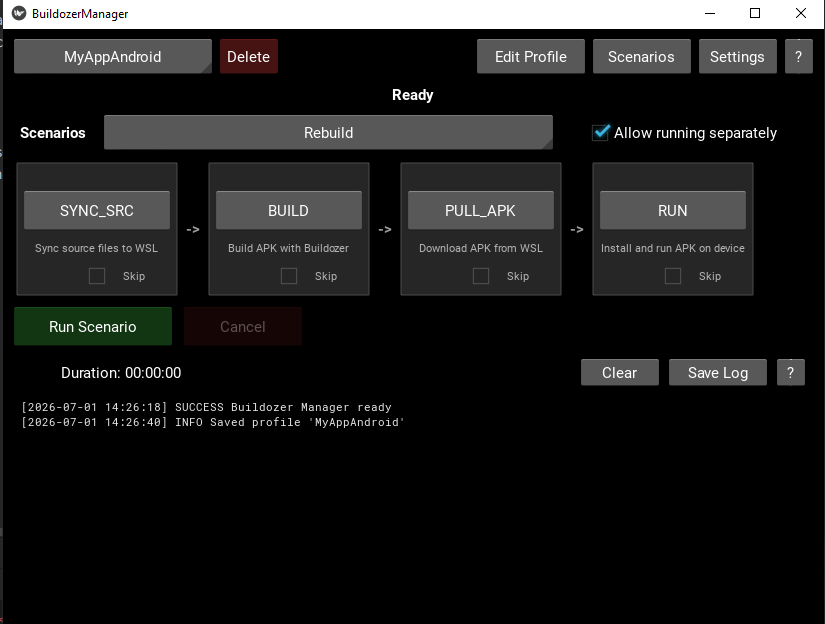

# BuildozerManager



A Kivy-based desktop GUI for managing [Buildozer](https://github.com/kivy/buildozer) Android builds — configure, build, and monitor your Kivy APK builds without touching the command line.

> **Status:** Done. We know there may be bugs — please let us know if you find any.

---

## How It Works

Development happens on your **Windows machine** (the app runs natively). When you trigger a build:

1. Your Kivy project source is copied to WSL.
2. Buildozer runs inside WSL to produce an APK.
3. The finished APK is copied back to Windows.
4. ADB (on Windows) installs the APK to your connected Android device.

---

## Prerequisites

- **Python 3.13+** on Windows
- **Kivy 2.3.1** (installed automatically via `requirements.txt`)
- **WSL** with a Linux distribution installed
- **Buildozer 1.6.0+** installed **inside WSL** and added to PATH
- **ADB** on your Windows machine (not included — install via Android Studio, SDK Platform-Tools, or your package manager of choice)

> ADB is **not** bundled with this project. You must have `adb` available on your Windows PATH.

---

## How to Run

1. **Create a virtual environment** (recommended):
   ```
   python -m venv venv
   ```

2. **Activate it:**
   - Windows: `venv\Scripts\activate`
   - Linux/macOS: `source venv/bin/activate`

3. **Install dependencies:**
   ```
   pip install -r requirements.txt
   ```

4. **Run the app:**
   ```
   python main.py
   ```

---

## Known Issues

- Unable to select continued text selection after scrolling in log panel
